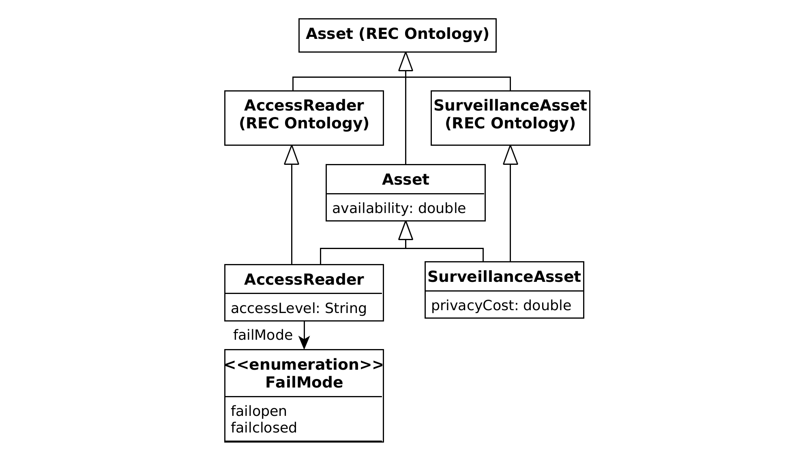
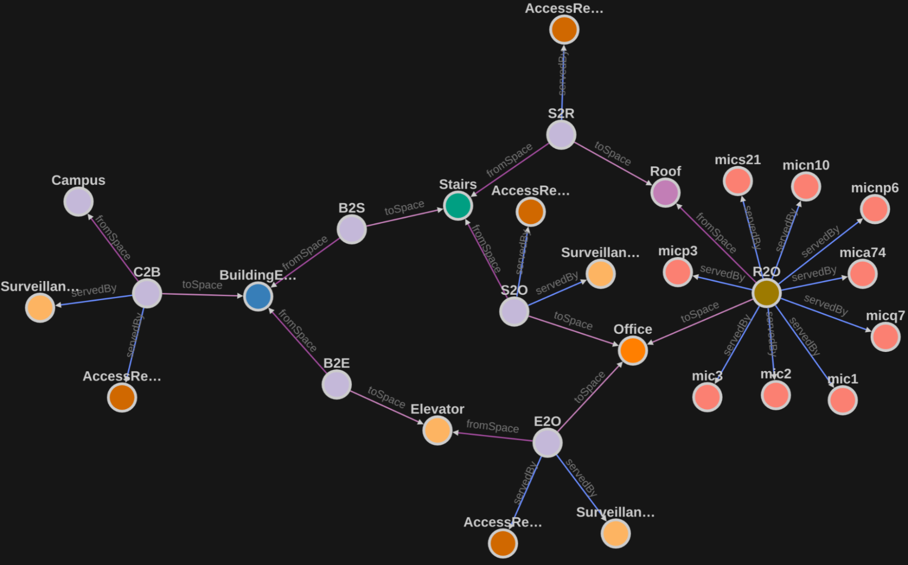
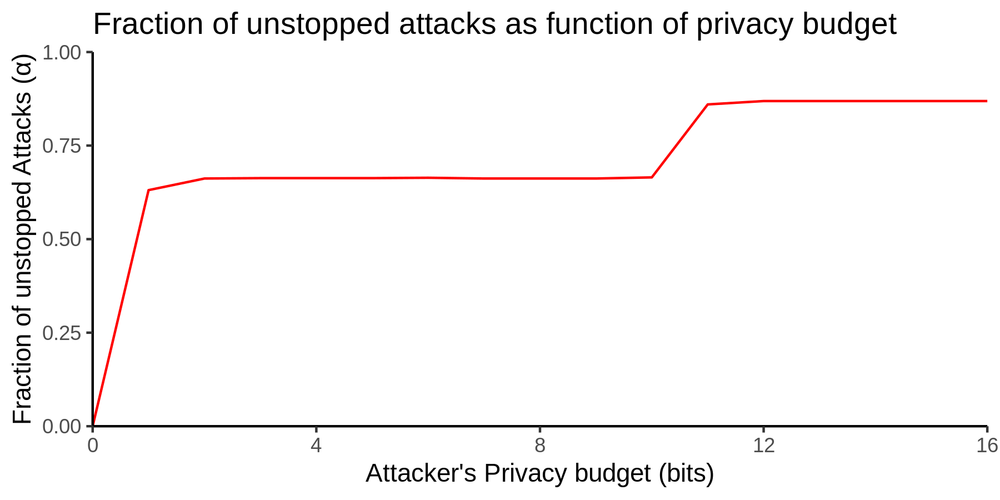

# Digital Twins Definition Language surveillance extensions

Preprint: Anj Simmons, A reliability measure for smart surveillance systems. https://arxiv.org/abs/2202.09339

## Motivation and purpose

The ontology in this repository extends Microsoft's [opendigitaltwins-building](https://github.com/Azure/opendigitaltwins-building) ontology with additional classes and properties for modelling and reasoning about surveillance and security. In particular, it adds the `availability` property to support reasoning about how likely a surveillance system is to actually be functioning at the time of an intrusion, as well as the concept of `failclosed` (e.g. a safe door that locks shut if there are any faults) and `failopen` (e.g. emergency exits that swing open if the building loses power).




## Sample

The sample directory provides a sample digital twin constructed using the ontology. Both a spreadsheet representation and `.json` export are provided. This can be imported into the [Azure Digital Twins Explorer](https://github.com/Azure-Samples/digital-twins-explorer) tool (after loading the opendigitaltwins-building models followed by the A2I2 models in the ontology directory).



## Scripts

The scripts directory contains the code to compute a reliability measure, α, of the surveillance system described by the digital twin, taking into account the adversarial nature of intrusion.

### Dependencies

The analysis script is implemented in Python3. There is also an optional visualisation of budget vs α implemented in R. To install all dependencies in a [conda](https://conda.io/) environment run:

```
conda create -n surveillance python=3 r-essentials r-base
conda activate surveillance
```

### Building

```
cd Scripts
./analyse.sh
```

### Sample Output

